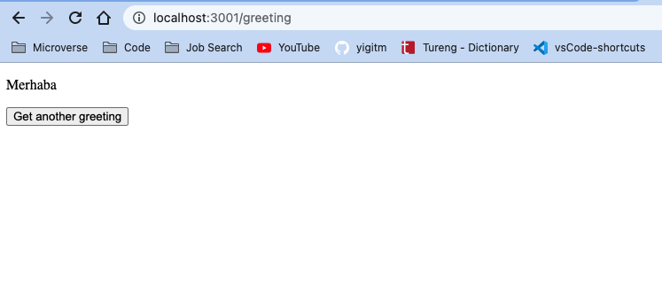
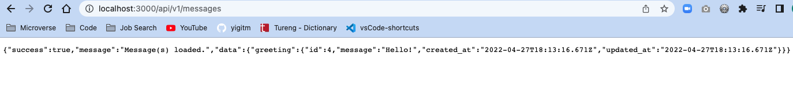

# React Frontend

## About

A React front-end that displays random messages by using a Rails API.



Development flow included: performing git-flow practices & using components with routers, life cycle methods, handling events and state management by Redux store, actions, reducers with asynchronous actions in [duck Pattern](https://github.com/erikras/ducks-modular-redux) including unit and component tests.

## Built With

- Javascript
- React & Redux
- Redux Middleware (Thunk, Logger)
- Axios
- Rails API

## Rails API

[Rails API repository](https://loving-lamarr-2cca8c.netlify.app/)



## Getting Started

To get a local copy up and run the app; follow below steps.

### Prerequisites

If you are not familiar to use terminal, please check this [article](https://www.theodinproject.com/courses/web-development-101/lessons/command-line-basics-web-development-101)

### Setup

Open your terminal and run the following commands on your terminal.

Make sure 'Javascript' is not blocked in your browser.

### Install

To get a local copy of the repository, run the following commands on your terminal.

```
cd <your_desktop>
```

```
git clone https://github.com/yigitm/react-frontend.git
```

```
cd react-frontend
```

### Usage

To install the necessary Javascript packages to your project, run below commands.

```
npm install
```

To run the app, use below command.

```
npm start
```

It runs the app in the development mode and runs the app in [http://localhost:3000](http://localhost:3000).

After app is run type this URL: http://localhost:3000/greeting

If your browser page is not open automatically; open your default browser and go to: http://localhost:3000/greeting

## Authors

👤 **Yigit Mersin**

- GitHub: [@github](https://github.com/ygtmrsn)
- LinkedIn: [@linkedIn](linkedin.com/in/yigitmersin)
- Twitter: [@twitter](https://twitter.com/ygtmrsn)

## 🤝 Contributing

Contributions, issues, and feature requests are welcome!

Feel free to check the [issues page](https://github.com/yigitm/react-frontend/issues).

## Show your support

Give a ⭐️ if you like this project!

## Acknowledgments

- [Microverse](https://www.microverse.org/)
- [Open Source](https://en.wikipedia.org/wiki/Open_source)

## 📝 License

Copyright (c) 2012-2022 Microverse

Permission is hereby granted, free of charge, to any person obtaining
a copy of this software and associated documentation files (the
"Software"), to deal in the Software without restriction, including
without limitation the rights to use, copy, modify, merge, publish,
distribute, sublicense, and/or sell copies of the Software, and to
permit persons to whom the Software is furnished to do so, subject to
the following conditions:

The above copyright notice and this permission notice shall be
included in all copies or substantial portions of the Software.

THE SOFTWARE IS PROVIDED "AS IS", WITHOUT WARRANTY OF ANY KIND,
EXPRESS OR IMPLIED, INCLUDING BUT NOT LIMITED TO THE WARRANTIES OF
MERCHANTABILITY, FITNESS FOR A PARTICULAR PURPOSE AND
NONINFRINGEMENT. IN NO EVENT SHALL THE AUTHORS OR COPYRIGHT HOLDERS BE
LIABLE FOR ANY CLAIM, DAMAGES OR OTHER LIABILITY, WHETHER IN AN ACTION
OF CONTRACT, TORT OR OTHERWISE, ARISING FROM, OUT OF OR IN CONNECTION
WITH THE SOFTWARE OR THE USE OR OTHER DEALINGS IN THE SOFTWARE.
